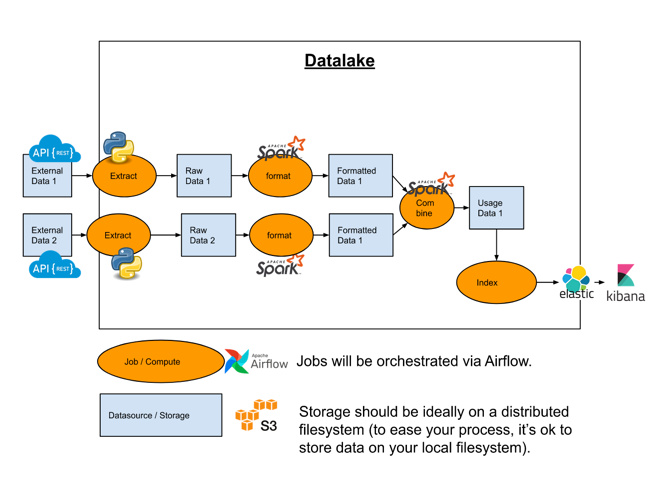
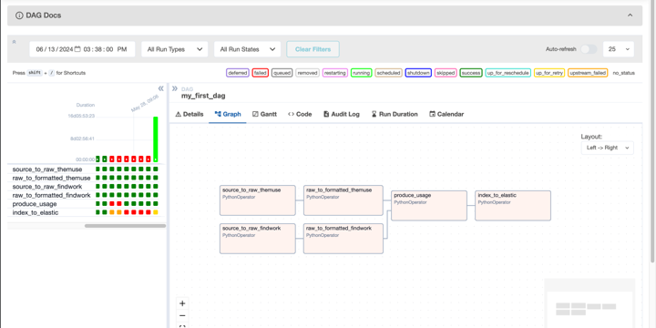

# Big Data Project

The goal of the 'Big Data Project' is to create a simple end-to-end data architecture, including data ingestion, data transformation and data exposition.

In our case, we decided to fetch Job Offers from well-known websites to analyze them and propose a simple evaluation and analysis of the current market.

As I have been asked, we have done our architecture in this way:

Which have been translated into an airflow dag to automatically run the whole project:

Furthermore, we implemented the Random Forest ML algorithm to enhance the analysis by giving a salary estimation based on the job description.

> [!TIP]
> **Random Forest Regressor**
> The Random Forest Regressor is an ensemble learning method that combines multiple decision trees to improve prediction accuracy and control overfitting. It operates by constructing multiple trees during training and outputting the mean prediction of the individual trees for regression tasks. This approach enhances model robustness and accuracy.

To conduct this feature, we have trained our model on thousands of data to make is are much accurate as possible.

